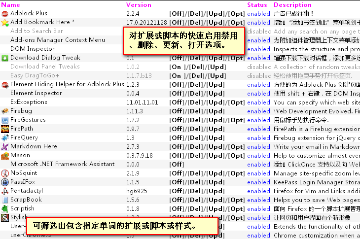
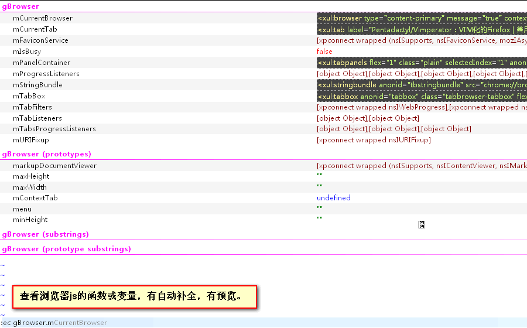
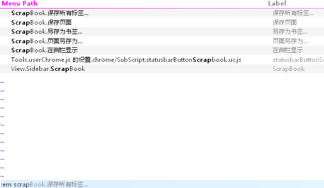
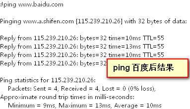
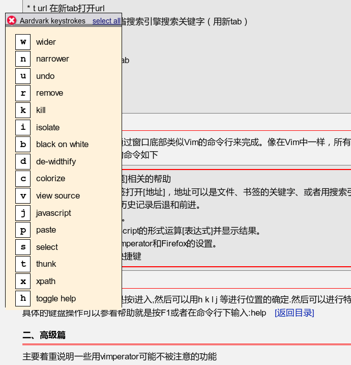

我最精简的扩展

 - AdBlock Plus, 可用奶牛代替。
 - FireGestures, 可用 StrokesPlus 代替。
 - pentadactyl, 无可代替。

vimperator 更适合初学者，pentadactyl 则需要一定的配置。我在没有配置的情况下会用 vimperator，否则用 pentadactyl。

### 图例

#### addon

#### 查看浏览器 js 的函数或变量，有自动补全、有预览

#### 快速查单词，使用了 dict.js 插件

#### 调用菜单命令

#### 外部命令

#### aardvark

### 下面是一些示例

`:set!` 直接设置 about:config。示例

    :set! devtools.chrome.enabled=true

自动设置 view_source.editor.path 和 scriptish.editor 的路径（多电脑专用）。当然也可以写的更强大点，但我这样已经够用了。

    var userPath = [
        "C:\\Program Files\\Sublime Text 2\\sublime_text.exe",
        "D:\\Program Files\\Sublime Text 2\\sublime_text.exe",
    ];
    (function checkEditorPath(){
        let path = prefs.get('view_source.editor.path');
        if(!File(path).exists()){
            for(var i = 0 ; i < userPath.length; i ++ ) {
                if(File(userPath[i]).exists()){
                    prefs.set('view_source.editor.path', userPath[i]);
                    prefs.set('extensions.scriptish.editor', userPath[i]);
                    break;
                }
            }
        }
    })();

打开附加组件侧边栏并关注焦点在搜索框。使用 `map <Leader>d -js toggleAddonSidebar();`

    function toggleAddonSidebar(){
        toggleSidebar("pentadactyl-viewAddonsSidebar");
        var sidebar = document.getElementById('sidebar');
        if(!sidebar.hidden){
          sidebar.addEventListener('DOMContentLoaded', function(){
              if (sidebar.contentDocument){
                  sidebar.removeEventListener('DOMContentLoaded', arguments.callee, false);
                  var search = sidebar.contentDocument.querySelector("#header-search");
                  if (search) {
                      search.focus();
                  }
              }
          }, false);
        }
    }

我以前写过一个 小说阅读的扩展

 - 检测更新
 - 加入到书签